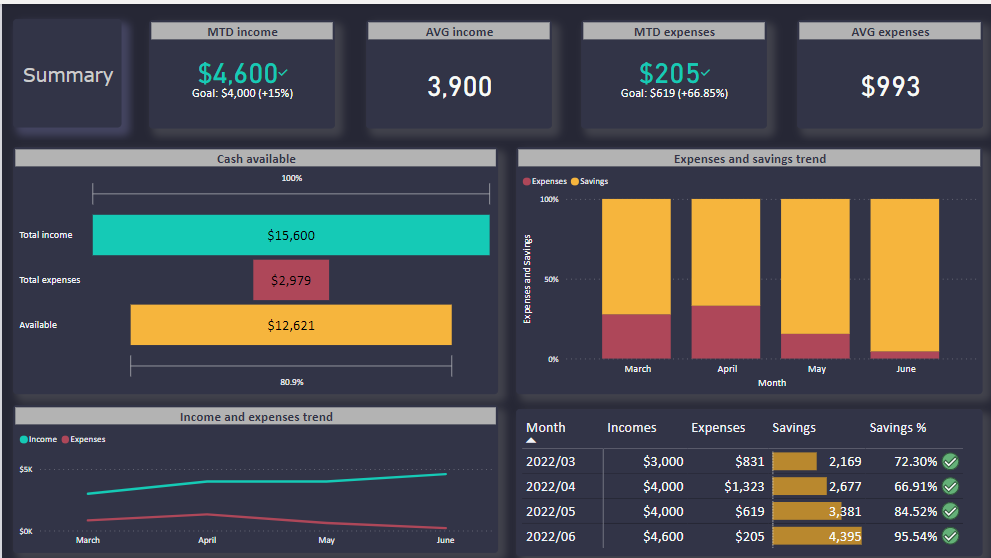
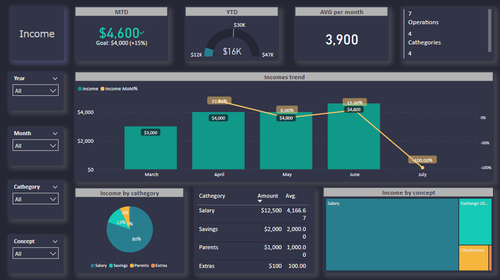
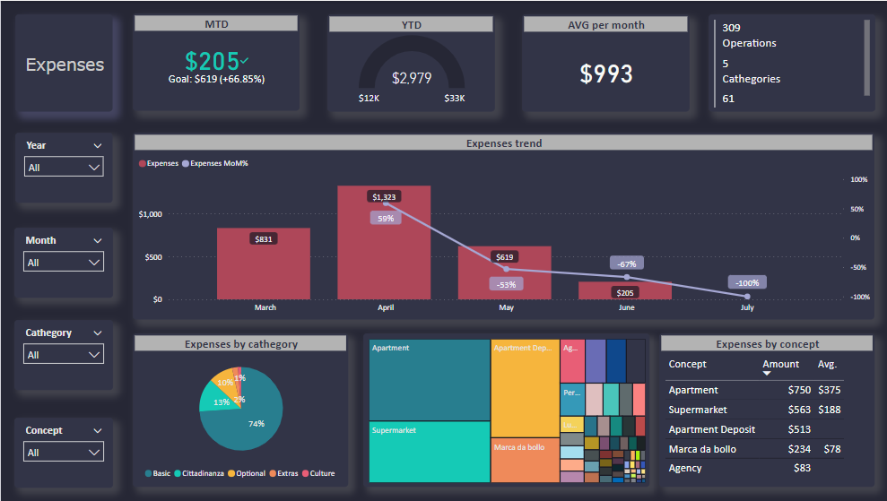
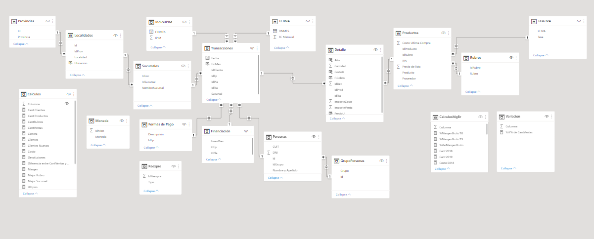
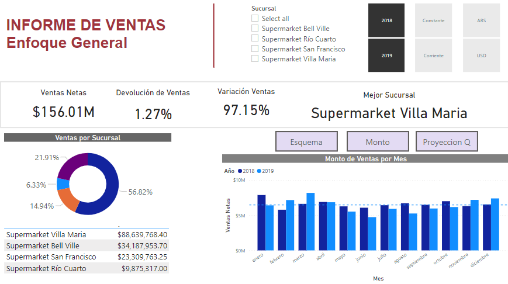
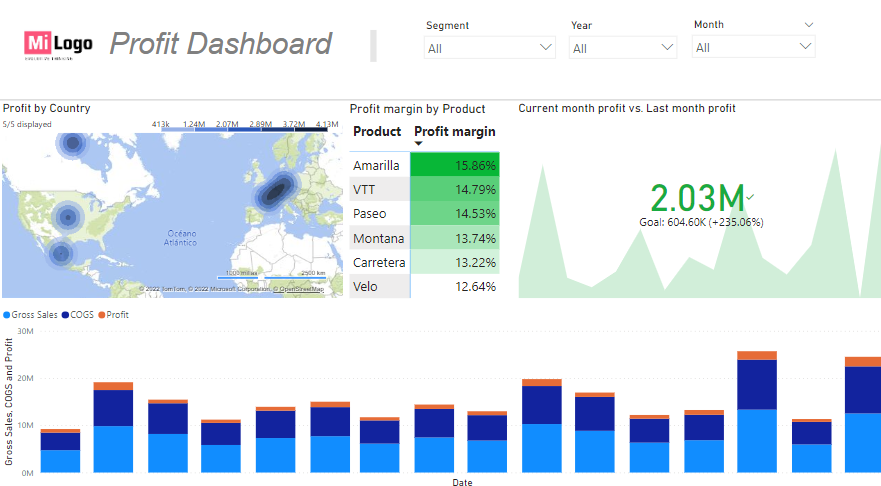

# Power BI projects
#### This repository helps me gather all the Power BI dashboards I enjoyed doing the most. You will find a _description_ of each project, the _implementation process_, a _preview_ of the dashboard, and the _PBIX file_.

## Content
1. Personal finances
2. Sales I
3. Sales II

### _Personal finances_
#### Description
This project is born after noticing the difficulty in making forecasts in my personal finances sphere. After some research, I realized that it was due to the lack of tracking and **analysis of income and expenses** (or at least it would be a great place to start).

The **project objective** is to build an interactive dashboard analyzing the magnitude, structure, and trends of income and expenses up to date.

At first, I developed it just for me and then personalized it for friends and family. Feel free to adapt it to your necessities and do not hesitate to propose improvements.

#### Implementation process
1. Incremental ETL. Frequency: once a month
   - Extract: export income/expenses data registered on a smartphone App into a csv file.
   - Transform: I use SQL workspace of BigQuery (Google Cloud) to merge all the data into a single income/expenses file, then I explore the data so I can check for errors, misspellings, inconsistencies and more. After that, I want to be sure that the data is clean (remove duplicates, replace misspelled words and format data). Finally, I make a brief analysis to know the overall pattern of income/expenses by cathegory and concepts. Once data is ready, I export a csv file to further visualization. I attached the SQL queries [here!](SQL/personal-finances.rmd)
   - Load: import csv file to Power BI and refresh every time new data is added. 
2. Modelling: 
   - Relationship: dates 
   - Facts: income and expenses, both real and targeted
   - Dimensions: date, cathegory, and concept
3. Analysis and Visualizations: please dive into the dashboard I attached in next section.

#### Results
* [PBIX file](pbix/personal-finances.pbix)
* Preview

### _Sales I_
#### Description
This is the **capstone project** developed as a team for the subject "computerized management" in the last year of my accounting degree. It is in Spanish, but you should know that I am working on its translation to English. 

The **project objective** is to build an interactive dashboard to:
1.	Obtain valuable insights into the magnitude, structure, and trends of sales/ profit
2.	Making sales forecasting

#### Implementation process
1. Prepare and clean the database
2. Modelling: 
   - Relationships
   - Facts: transactions (sales and cost)
   - Dimensions: date, branch, customer, currency, places, products, cathegory, paying method

3. Measures: 
   - Sum of sales, expresed in argentine pesos (taking into account inflation) and in dollars
   - Change month over month (MoM%) 
   - TopN of products and customers
   - Profit margin
   - Count of dimensions
4. Analysis and Visualizations: please dive into the dashboard I attached in next section.

#### Results
* [PBIX file](pbix/sales-I.pbix)
* Preview

### _Sales II_
#### Description
This is a project developed just for **learning purposes**. 

The **project objective** is to build an interactive dashboard to:
1.	Analyze sales and profit, in different dashbaords
2.	Visualize KPIs

#### Implementation process
1. Load data
2. Modelling: 
   - Identification of facts: sales and cost
   - Identification of dimensions: date, segment, country, product, discount band
3. Measures: 
   - Sum of sales
   - Profit
   - Previous sales
   - Previous profit
   - Profit margin
4. Analysis and Visualizations: please dive into the dashboard I attached in next section.

#### Results
* [PBIX file 1](pbix/sales-II-part1.pbix)
* [PBIX file 2](pbix/sales-II-part2.pbix)
* Preview

